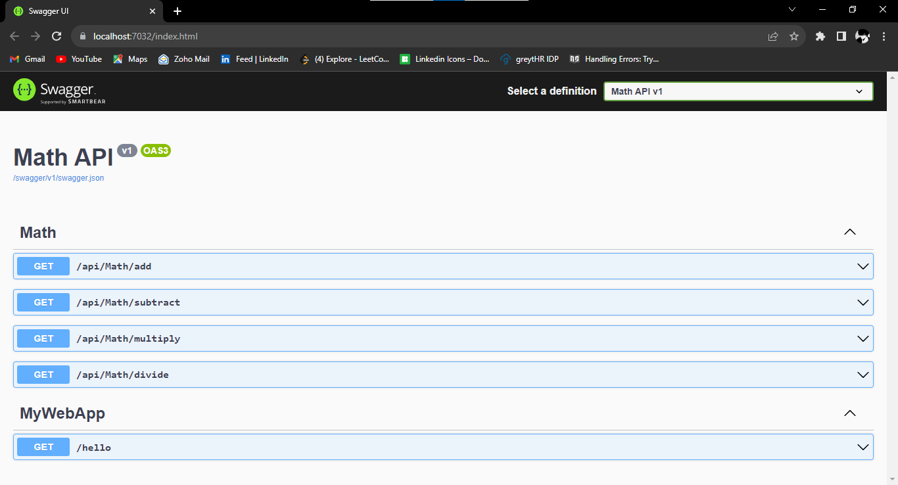

# Assignments-

## Assignment - 1
- Write a class LengthHelper with function findLength that takes string as parameter and returns the length of string. This can be a class libarary/console.
  Create a unit test project using Xunit and write test cases to find length of string for "", "123", "123456789010", NULL.

## Assignment -2 
- In visual studio, Create Classlibrary project. Declare a class Demo in it. In Demo class write member function called message that prints "I am great" on the terminal. Compile the project. Now add console application  project in the same solution/workspace and in the console application use the Demo class reference and create its instance and call the function message.

## Assignment -3 
Write a Singleton class called Counter. It will have two functions Increment and Decrement that will increase and decrease the count respectively.
It has one property called count that returns the current counter. The class will have one static getinstance method to return the instance of Counter. 
Singleton typically means that only one instance of the class can be created.

## Assignment -4 
Extension Method
Extend the string class, add a new function called ToCurrency(). If string contains numbers, the function will prepend $ sign to and return a new string or else it will throw an exception.

## Assignment -5
Write a class ConsoleParser that has a run function that reads input from console, it also takes onWord, onNumber and onJunk delegates as the parameter and calls onWord or onNumber or onJunk delegates based on the following algorithm
The consoleparser continously reads the input from the console using ReadLine and if it encounters a word that is group of english characters, it calls onWord.If it encounters a group of numbers, it calls onNumber and if the input has junk (non alphabet or non numbers) characters it calls onJunk.
You can assume user will enter one word at a time and if the word has junk characters it will always call
onJunk, if the input has both numbers and english characters, it will always call onWord, and if the input has only numbers, it will call onNumber.

## Assigment -6
Create ASP.NET project using .net core 5.Use app.MapGet to specify localhost/{portnumber}/hello and respond to it with hello world.

## Assignment -7
Implement controller that exposes Math class over web api. The functions name of the controller shouldnt be same as the webapi endpoint.
Also Enable Swagger.
Interface IMath has multiply, divide, substract, add functions. 
Implement Math class that extends the IMath interface.

## Assignment -8 
ASP.NET - 3 - Dependency Injection . 
Redo ASP.NET - 2 using Scoped, TRansient and Singleton . 
Update readme in the github to highlight the difference between the 3 types and when not to use which one.

### Transient 
Transient objects are always different; a new instance is provided to every controller and every service.
When to use - Use Transient for lightweight services with no state, as it creates new instance everytime it is called. 

### Scoped
Scoped objects are the same within a request, but different across different requests.
When to use - Use Scoped when you want to maintain state within a request.

### Singleton 
Singleton objects are the same for every object and every request.
When to use - Use Singletons where you need to maintain application wide state.

## Output 

